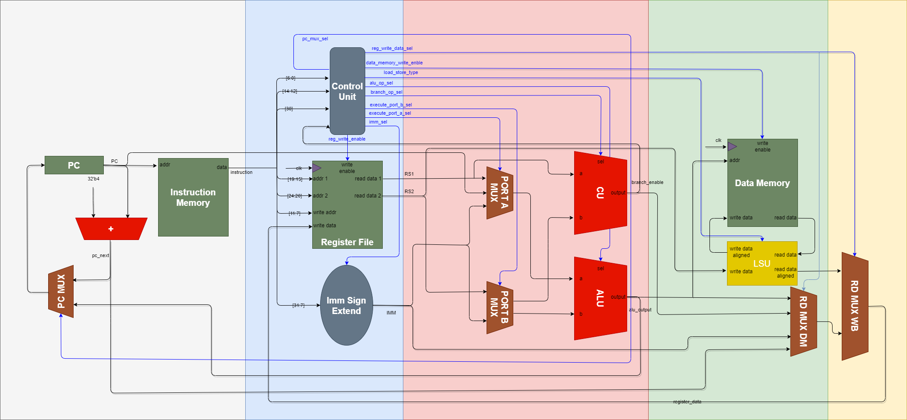

# RV32I RISC-V Processor



This repository contains the SystemVerilog implementation of two types of RV32I RISC-V processors: a single-cycle processor and a multi-cycle processor. The RV32I architecture is a 32-bit base integer instruction set architecture from the RISC-V family.

## Folder Structure

- `src`: Contains the source code for the RV32I processors.
  - `multi_cycle_processor`: Implementation of the multi-cycle processor.
  - `single_cycle_processor`: Implementation of the single-cycle processor.
  
- `tb`: Contains test benches and simulation scripts for verifying the processor's functionality.

- `doc`: Contains documentation related to the project.
  - `images`: Stores images used in the documentation.

## Features

- Support for RV32I instruction set architecture.
- Implementation of both multi-cycle and single-cycle processors.
- Written in SystemVerilog for FPGA implementations.

## Project Status

This project is currently in a hobbyist or educational stage and is designed to provide a basic understanding of RV32I RISC-V processors. It does not include advanced features such as cache or branch predictors. While there are plans to improve the design in the future, due to time constraints, the project may not be expanded to a full-fledged processor with all advanced functionalities.

## Important Note

This RV32I RISC-V processor implementation is based on an earlier version of the RISC-V ISA (Instruction Set Architecture). As a result, it may not include all the features, extensions, or instructions introduced in the latest RISC-V ISA versions.

Please be aware that if you are looking for a processor that fully supports the latest RISC-V ISA specifications, this project may not meet those requirements. However, it can still serve as a valuable educational resource and a starting point for understanding RISC-V architecture and digital design principles.

If you require a processor with the latest ISA features, we recommend exploring other projects or implementations that align with your specific needs and target ISA version.

## Getting Started

Follow these steps to get started with the RV32I RISC-V processors:

1. **Clone the Repository:**
```shell
# Download repo.
$ git clone https://github.com/HarieshAnbalagan/RV32I.git
$ cd RV32I
```

2. **Simulation and Testing:**
- Navigate to the `tb` directory for simulation scripts and testbenches.
- Use your preferred EDA tools for simulation (e.g., ModelSim).

3. **Documentation:**
- Refer to the `doc` directory for detailed documentation on the processor's architecture and design principles.

4. **Contributing:**
- If you'd like to contribute to this project, please see the [CONTRIBUTING.md](CONTRIBUTING.md) file.

## License

This project is licensed under the MIT License - see the [LICENSE](LICENSE) file for details.

## Acknowledgments

The RISC-V community for their open and collaborative approach to instruction set architecture design.

## Contact

If you have any questions, suggestions, or issues, please feel free to open an issue in this repository or contact us at [harieshanbalagan@outlook.com](mailto:harieshanbalagan@outlook.com).

Happy coding!